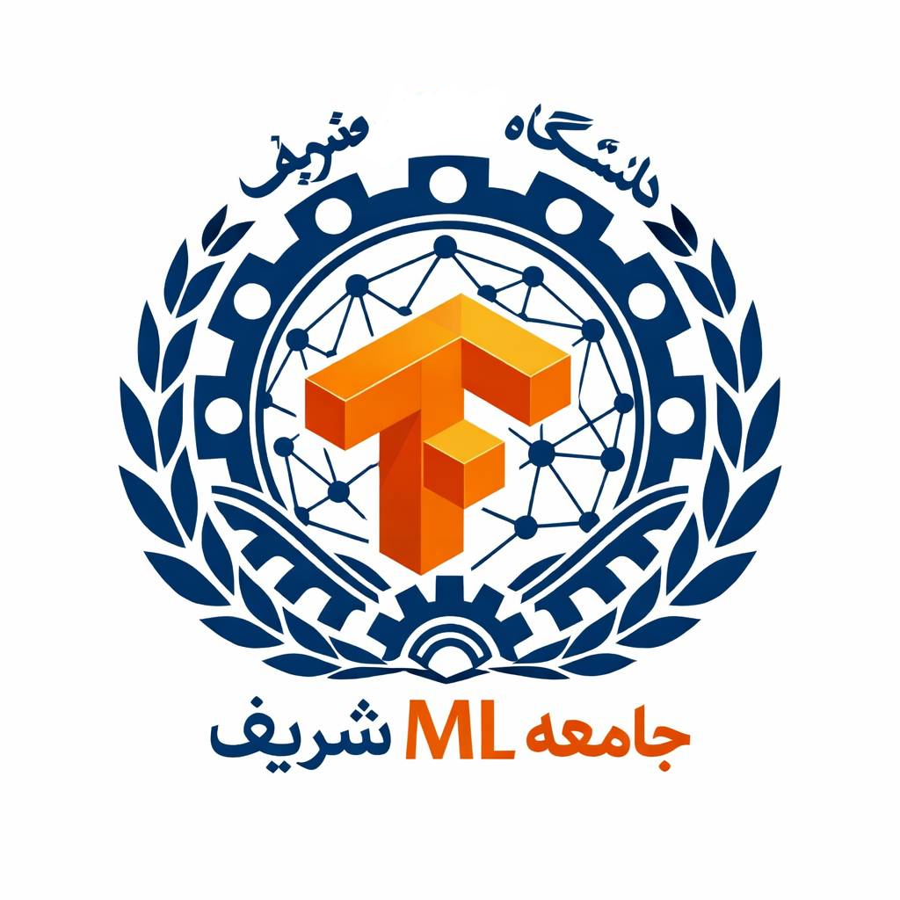

# SUT ML Community Lab

student-moderated community for data science & machine learning at Sharif University of Technology (SUT)

## Core Team
- [Ermia Moghadamy](https://github.com/ErmiaMoghadamy) (Founding Lead)
- [Hamed Mirzaei](https://www.linkedin.com/in/hamedmirzaei1) (Executive & Core Presentor)
- [Taha Mohamadi](https://www.linkedin.com/in/taha-mohammadi-603810391/) (Executive & Core Presentor)

## Status
- [X] Introduction to Community (session #0)
- [X] Introduction To Machine Learning (session #1)
- [X] Honor Lecture + End-to-End Machine Learning Part I (session #2)
- [ ] End-to-End Machine Learning Part II (session #2)

## Resources
- Hands on ML (O'Reilly)
- Data Science Handbook (O'Reilly)
